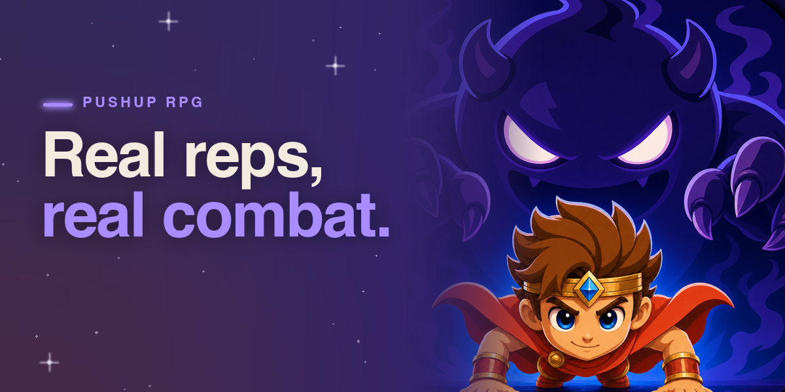

# Pushup RPG: Fitness Quest — Seeker Edition




> **Source code is proprietary and not included in this repository.**
> This repository is a showcase. It holds a description of the app, a ledger of our commits, store images and a
> link to the signed APK. It contains no code. [Why no source](#why-no-source) says why, and
> [Verifying our work without the source](#verifying-our-work-without-the-source) says what you can check instead.

**Your push-ups are the attack button.** Prop your phone on the floor, and its camera counts every real push-up or
squat on the device. Each rep strikes the monster on screen. Pushup RPG is a fitness RPG built to become a daily
habit: a story campaign, an endless dungeon, loot, streaks, and live duels with friends and guilds. The Seeker
Edition adds the Solana Mobile Stack. You sign in with your wallet in one approval, and you unlock the membership
with SOL, straight from your wallet.

| | |
|---|---|
| Solana dApp Store | listed as "Pushup RPG" in the Solana dApp Store app on Seeker (no web page for the listing yet) (`com.pushuprpg.solana`; first released there as 2.5.9-sol, versionCode 65, on 2026-09-24) |
| Promo video (12 s) | https://www.youtube.com/watch?v=dJzMk57tr-s |
| Pitch deck | https://pushup.quest/decks/pushup-rpg-investor-overview-2026-09-25.pdf |
| Signed APK, the same build as the 2.5.9-sol store release | https://github.com/yerasyla/pushup-rpg-seeker/releases/download/v2.5.9-sol-65/PushupRPG-Seeker-2.5.9-sol-65.apk (68 MB, arm64) |
| APK SHA-256 | `4672b0f3cda17ba9866446605cad7ef07ac950b3d406b86ab030452255d71b10` |
| Website | https://pushup.quest |

---

## What the app is

- **Rep counting by the camera, on the device.** CameraX feeds Google ML Kit pose detection, and the app turns the
  body's movement into counted reps. It is built to count only full reps. It counts push-ups and squats, and each
  movement keeps its own records. The camera feed never leaves the phone, and no server ever sees it. Clip
  recording is off by default, and a recorded clip stays on the phone unless the player shares it.
- **A real RPG.** A story campaign across eight realms, 48 foes and bosses that each fight their own way, the
  Endless Descent (a roguelike dungeon), hero stats, loot with rarities, a skill tree and a loadout.
- **Built for a daily habit.** Daily and weekly quests, streaks with streak freezes, reminders, home-screen widgets,
  and daily and weekly world leaderboards for push-ups and for squats.
- **Social.** Live duels with friends, the Arena (a match against a stranger in seconds), six rivals you can fight
  offline, and guilds that raid a shared boss every week.
- **One account everywhere.** The same account and progress work on iOS, Google Play and Seeker. The app is
  available in 13 languages.
- **Free to play.** The workout is never behind a paywall. The membership adds convenience and flair.

## Built for Seeker

| Feature | What happens |
|---|---|
| **Wallet sign-in in one approval** | The player taps *Connect wallet*. The app opens the wallet through Mobile Wallet Adapter with a single `authorize` request that carries a Sign-In-With-Solana message for pushup.quest, and the player approves once. Our server verifies the signature, and checks that the message is for our domain, fresh and used only once. Only then does it link the wallet to the player's current account, or sign the player in to the wallet's own account. There is no email and no password. A guest can connect a wallet later. |
| **Membership paid in SOL** | The Vigil Membership costs 0.1 SOL for 30 days or 0.4 SOL for 365 days. The app builds a plain SOL transfer, and the wallet signs and sends it through Mobile Wallet Adapter in the same session. A pass never renews, so there is nothing to cancel. *Add time* extends it, and a reminder arrives two days before it ends. Prices come from our server, so they can change without an app update. |
| **Verified on the server** | The app never grants itself a pass. Our server reads the transaction from Solana mainnet. It grants the pass only if the transaction is confirmed and succeeded, pays at least the price to our treasury, comes from the wallet linked to the player's account, and has never been redeemed before. The pass then unlocks the same account on Seeker, Android and iOS. |
| **No lost payments** | The app records the transaction signature the moment the wallet returns it. A payment that may have moved SOL is kept and settled later, never dropped. *Restore* finds payments the app never heard about, for example when the app was closed while the wallet was open. |
| **Push notifications** | The Seeker build has Firebase Cloud Messaging for duel challenges and other game events, as well as local reminders for streaks and for the end of a pass. |
| **Rep counting on the Seeker** | The whole pose pipeline runs on the Seeker itself, and no video is sent anywhere. |
| **A Seeker-native build** | The Seeker build has its own package (`com.pushuprpg.solana`) and its own signing key, and it is arm64. It has no Google Play Billing and no in-game gem store. Google sign-in opens in a browser tab. It installs alongside the Google Play version of the app. |

## Architecture

```
 Seeker / Android phone: Kotlin, Jetpack Compose
 ┌───────────────────────────────────────────────────────────────────┐
 │  CameraX ──► ML Kit pose detection ──► rep counter ──► game rules │  on the device;
 │                                                  (combat, loot,   │  no video leaves
 │                                                   quests, streaks)│  the phone
 │                                                                   │
 │  Mobile Wallet Adapter client ◄──── one session ────► wallet app  │
 │                                (Seeker wallet, Phantom, Solflare) │
 └──────────────┬───────────────────────────────────────▲────────────┘
                │ HTTPS: accounts, cloud save,          │ push
                │ duels, guilds, leaderboards           │
                ▼                                       │
   Supabase: Auth · Postgres with row-level security ───┴── Firebase Cloud Messaging
             · server functions (shared with the iOS and Google Play apps)
                │
                │ read-only JSON-RPC (payment verification)
                ▼
          Solana mainnet
```

**How a SOL payment flows**

```
 Player taps a pass
   │
   ▼
 App ──── reads the current SOL price ───────────────────────► our server
   │
   ▼  one Mobile Wallet Adapter session
 Wallet ── signs and sends the SOL transfer ─────────────────► Solana mainnet
   │
   ▼  the app stores the transaction signature at once
 App ──── asks the server to verify that signature ──────────► our server
                                                                 │ reads the transaction from mainnet
                                                                 │ confirmed and succeeded?  at least the price?
                                                                 │ paid to our treasury?  from this account's wallet?
                                                                 │ never redeemed before?
                                                                 ▼
                                             pass granted on the account ──► Seeker · Android · iOS
```

**The stack**

- **Android:** Kotlin, Jetpack Compose (Material 3), CameraX, Google ML Kit Pose Detection, Jetpack Glance
  widgets and Firebase Cloud Messaging. It runs on Android 8.0 (API 26) and later, and targets API 36.
- **Solana:** Solana Mobile's Mobile Wallet Adapter client library for Kotlin, Sign-In-With-Solana, and the
  sol4k library to build the transfer.
- **Backend:** Supabase (Postgres with row-level security, Auth, and server functions in TypeScript). One backend
  serves the iOS, Google Play and Seeker apps.
- **One codebase, two storefronts.** The Google Play app and the Seeker app are built from the same Android source.
  Each build carries only its own store's dependencies: the Play build has no Solana code, and the Seeker build
  has no Play Billing.

## What existed before the hackathons, and what we shipped during them

**Before the hackathons.** Pushup RPG was already a live product. Work on the iOS app began on 2026-06-01, and it
has been on the Apple App Store since July 2026. The Android app has been in development since about July 2026
and is on Google Play. An early, unfinished Solana scaffold also existed: a Seeker build with client code for
wallet sign-in and sending SOL, first drafts of the two server functions that check a wallet signature and a SOL
payment, a draft database schema (one of its files carries the date 2026-06-22 in its name), and a design note. It was already in the
first commit of our Android repository (2026-08-11), and the ledger counts 1,624 changed
lines on Solana paths before 2026-09-08. None of it had been deployed, used on mainnet or published. The game
itself (camera rep counting, the campaign, duels, guilds and leaderboards) predates both hackathons.

**The Seeker week, 2026-09-18 → 2026-09-25.** In this week we finished the Seeker Edition and shipped it, taking it
from that scaffold to a live release. The draft schema was replaced, the payment verification was rewritten, and
the server functions were deployed for the first time.

| Date | Work |
|---|---|
| 09-18 | Work on the Seeker Edition starts. The server side is prepared for real SOL payments, and the Seeker build gets its own signing key. |
| 09-19 | A pre-launch review of the payment path is done, and the six blocking issues it found are fixed before the server goes live. Server-side payment verification is rewritten and deployed. Prices move into the database. Wallet sign-in is rebuilt the way Solana Mobile documents it, as one `authorize` that carries a Sign-In-With-Solana message. **The payment path is verified end to end with a real payment on mainnet.** *Restore*, *Add time* and the pass-end reminder are added. The pass is sold as a pass that never renews. The Seeker build drops the gem store, and it is built as an arm64 APK. |
| 09-20 | Protections on sign-up by wallet go live on the server. Push notifications are added to the Seeker build; they ship from 2.5.9-sol, because the 2.5.8-sol build submitted that day predates them. First submission to the Solana dApp Store (2.5.8-sol). |
| by 09-22 | The store's review asks for a fix to our publisher profile's website, not to the app. 2.5.8-sol is never published. |
| 09-24 | 2.5.9-sol (versionCode 65) is released and **live on the Solana dApp Store**. |

**By the numbers,** from the [commit ledger](ledger/LEDGER.md) of our private repository:

| Window | Commits | Lines inserted / deleted | Commits on the Seeker-only code | Lines changed there |
|---|---:|---:|---:|---:|
| Seeker week, 2026-09-18 → 09-25 | 74 | +19,016 / −4,200 | 21 | 3,624 |
| Colosseum window, from 2026-09-14 | 179 | +56,570 / −9,778 | | |
| Clock In window, from 2026-09-08 | 214 | +79,179 / −10,449 | | |

- Line counts measure volume, not quality. They include tests, translations and data files as well as app code.
- "Seeker-only code" means the Seeker build's own source, its tests and design note, and its server functions and schema. Seeker work done in
  code that both editions share is not counted there, so that figure is a floor.
- The 2.5.9-sol APK was built from a commit dated 2026-09-22. The APK records that commit's id in its own build
  metadata, and the same id is a row of the ledger (see *Verifying*, item 3). Commits after that one are not in
  the APK.
- The same weeks also brought game features that ship in this build: duel clip recording (2026-09-16) and squat
  duels (2026-09-18). Both were ported from our iOS app, where they were built first. In this build, a friend's
  squat challenge accepted from a link or a notification still runs as push-ups; that is fixed for the next release.

## Verifying our work without the source

We know a code-free repository asks judges to take more on trust, so here is what can be checked.

1. **The commit ledger.** [ledger/LEDGER.md](ledger/LEDGER.md) and [ledger/COMMITS.csv](ledger/COMMITS.csv) list
   every commit on the main branch of our private repository up to `749051e` (2026-09-25): its hash, dates and size, with no code, no file names and no commit
   messages. A commit hash is a fingerprint of the complete code at that commit and of all the history before it.
   Publishing it reveals nothing about the code, but it commits us to it: in the git check (item 4), you can pick any row,
   and git will print the same hash, dates and line counts from our repository. Commit dates are written by our own
   machine, so the ledger proves content and order, not time. The date we submitted it to the hackathons is the
   independent upper bound.
2. **Public release dates.** The app went live on the Solana dApp Store on 2026-09-24, as 2.5.9-sol. The store shows
   its current version, which can be a later one. The app's App Store and Google Play listings show its earlier
   releases, which predate the hackathons.
3. **The app itself.** Install the APK and try it (see below). It is the build released on the store on 2026-09-24.
   `apksigner verify --print-certs` shows who signed it, and `aapt dump badging` shows
   `com.pushuprpg.solana`, 2.5.9-sol, versionCode 65. The Android build tools also record the commit the APK was
   built from: `unzip -p PushupRPG-Seeker-2.5.9-sol-65.apk META-INF/version-control-info.textproto` prints
   `9c8df00f663bbd46551bf57a6be2bd2d1c8ddbdb`, which is a row of the ledger.
4. **A live git check.** On request we screen-share a terminal in our private repository. You pick any row of the
   ledger, and git prints that commit's hash, dates and line counts, and the total number of commits, so you can
   compare them with the ledger. No source code, file names or commit messages are shown. Contact:
   support@pushup.quest.

## Install the APK

**You need:**

- An **arm64** Android phone running **Android 8.0 or later**. The Seeker qualifies, as do most current phones. The APK has no 32-bit or x86 code, so an emulator must use an arm64 system image.
- A **camera**, for rep counting. Without camera permission a battle does not count reps: the app shows "Camera needed" and a button that opens Settings.
- For wallet sign-in and SOL passes, a **wallet app that supports Mobile Wallet Adapter**, such as the Seeker's
  built-in wallet, Phantom or Solflare. An emulator has no wallet. You can also play as a guest, or sign in with
  Google or email.

**Steps:**

1. On a Seeker, the simplest way is to install it from the Solana dApp Store app: search for "Pushup RPG".
2. Otherwise, download the APK: https://github.com/yerasyla/pushup-rpg-seeker/releases/download/v2.5.9-sol-65/PushupRPG-Seeker-2.5.9-sol-65.apk.
3. Optionally, check the file. `shasum -a 256` on macOS or `sha256sum` on Linux must print
   `4672b0f3cda17ba9866446605cad7ef07ac950b3d406b86ab030452255d71b10`.
4. Open the file on the phone and allow your browser or file manager to install unknown apps when Android asks.
   Or, from a computer: `adb install PushupRPG-Seeker-2.5.9-sol-65.apk`.
5. Open **Pushup RPG** and follow the short onboarding. To count reps, prop the phone low on the floor in portrait
   and step back until your body from head to hips is in the frame.

**Good to know:**

- The Seeker package (`com.pushuprpg.solana`) is separate from the Google Play one, so both can be installed.
- This build talks to our live servers, the same ones the iOS and Google Play apps use. Signing in creates or
  opens a real account. A guest account or a throwaway wallet is fine for trying it out.
- **Buying a pass sends real SOL on mainnet.** You do not need to buy one to evaluate the app.

## Why no source

Pushup RPG is a live commercial product. One Android codebase builds both the Google Play app and the Seeker app,
and it shares a backend with our iOS app. The rep counting and the fair-play logic around it are the core of the
product: real players rely on them in leaderboards and live duels. We have decided not to publish that code, even
for a hackathon. We know some hackathon rules ask for a repository that contains the source, and that this
submission does not meet that requirement. We accept that it may cost us eligibility or points. Rather than submit
a stripped-down or misleading repository, we have made the verification paths above available: the ledger, the
live app, and a screen-shared git check.

## Team

Built by Yerasyl Amanbek (Founder & CEO).

Contact: support@pushup.quest · Support: support@pushup.quest · https://pushup.quest

---

© 2026 Yerasyl Amanbek. All rights reserved. The images in `media/` are Pushup RPG store assets. Nothing in this
repository is licensed for reuse.
